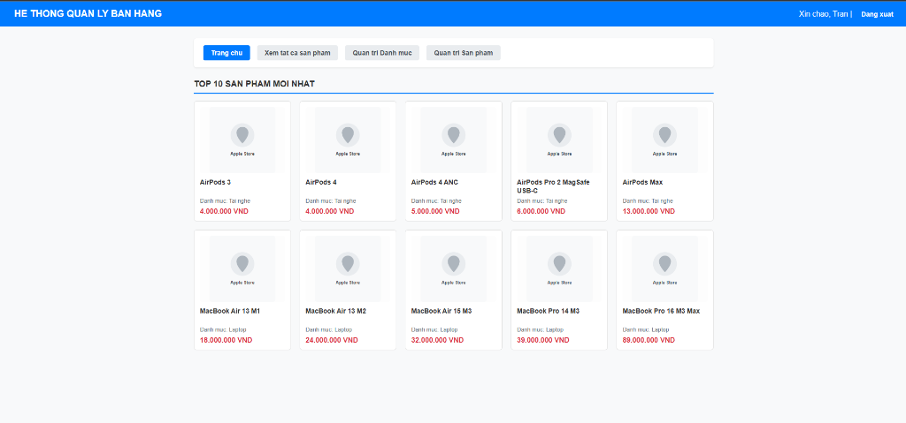
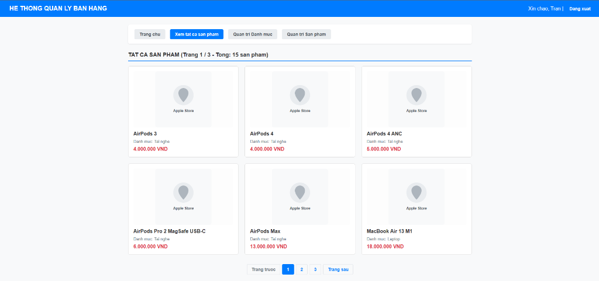
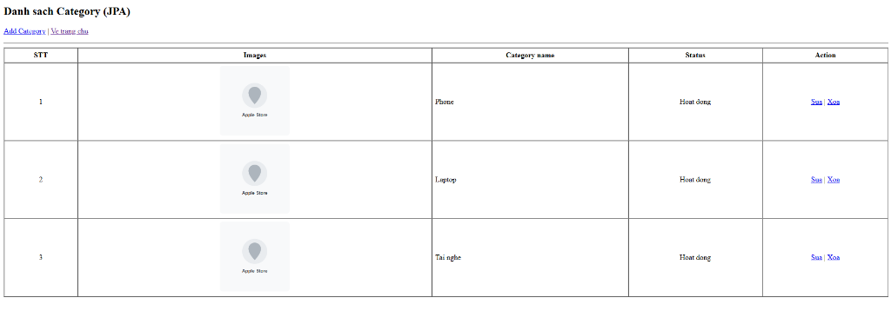
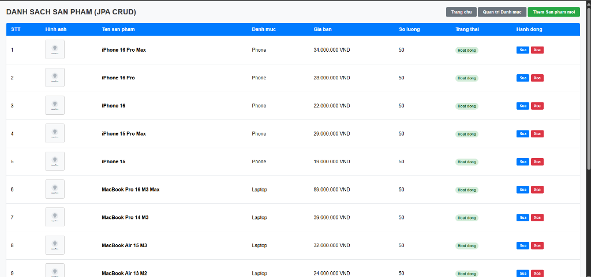
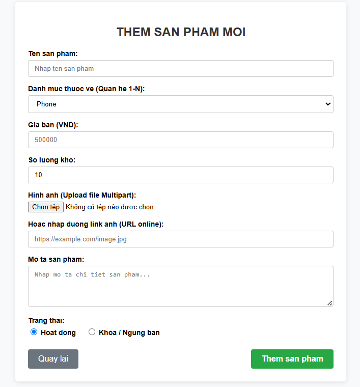

# BÀI TẬP 03

---

## I. YÊU CẦU

1. Bổ sung chức năng kích hoạt tài khoản bằng OTP được gửi qua email khi đăng ký tài khoản.
2. Thực hiện chức năng đăng nhập.
3. Thực hiện chức năng quên mật khẩu gửi xác nhận OTP qua mail.
4. Thêm bảng products vào database với mối liên hệ 1-n với bảng category trước đó, sau đó thực hiện CRUD cho bảng Products. Hướng dẫn upload file bằng Multipart.
5. Hiển thị 10 sản phẩm mới nhất lên trang chủ.
6. Hiển thị tất cả sản phẩm được phân trang 6sp/trang hiển thị trên trang có URL là `/product`.
7. Hiển thị chi tiết 01 sản phẩm khi bấm chuột vào sản phẩm đó trên trang chủ và trên trang product.

---

## II. HÌNH ẢNH

### 1. Kích hoạt tài khoản bằng OTP gửi qua email khi đăng ký tài khoản

---

### 2. Quên mật khẩu gửi xác nhận OTP qua mail

---

### 3. Hiển thị 10 sản phẩm mới nhất lên trang chủ

---

### 4. Hiển thị tất cả sản phẩm được phân trang 6sp/trang hiển thị trên trang có URL là /product

---

### 5. Quản lý danh mục (Category)

---

### 6. CRUD cho bảng Products và upload file bằng Multipart

